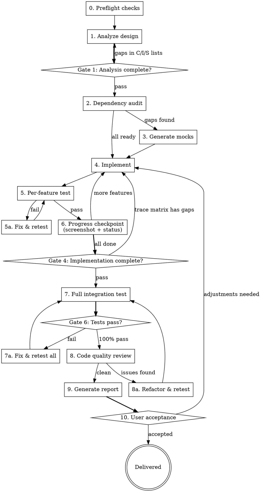

# Design-to-Code

Autonomously implement UI from design sources. Detect project framework, mock missing dependencies, test all functionality, and deliver a complete report with screenshots for user acceptance review.

## When to Use

- User provides a design source (image, HTML prototype, Figma link, PDF annotated mockup) and expects autonomous implementation
- Design references APIs or data that may not exist yet
- Single-page or multi-page designs
- Any frontend framework (including desktop: Tauri, Electron)

## Core Workflow



**Fully autonomous.** Zero user interaction from start to finish. The ONLY user touchpoint is the final report delivery.

**Single-agent mode — do NOT use the Agent tool.** This skill runs entirely inline. All phases (analysis, implementation, testing, reporting) are executed directly by you in the main conversation. Using subagents hides output from the user and makes progress invisible. If the task is large enough to need subagents, use `design-to-code-team` instead.

**Do NOT ask the user:**
- "Should I proceed?" — always proceed
- "Which approach?" — choose the best one, document in report
- "Should I fix this?" — fix it silently, document in report
- "Is this OK so far?" — keep going, report at the end
- "Want me to run tests?" — always run tests
- Progress updates mid-development — save for final report

**The ONLY time to stop and ask:**
- No `package.json` found AND no architecture doc specifying the stack (can't detect or infer framework)
- Build fails on existing code before you've made any changes (not your bug to fix without asking)

---

## Gates (Phase Transition Rules)

Each phase has an exit gate. **Do not proceed to the next phase until the gate passes.** If a gate fails, loop back and fix — never skip.

| Gate | After Phase | Pass Criteria | Fail Action |
|------|-------------|--------------|-------------|
| **Gate 1** | Phase 1 (Analyze) | Every visible UI element has a C-item. Every interactive element has an I-item. At least Loading/Empty/Error states in S-list. | Re-analyze the design, fill gaps |
| **Gate 4** | Phase 4 (Implement) | TypeScript zero errors. Every C-item has a corresponding component file. Trace Matrix "Implemented" column is 100% filled. | Continue implementing missing items |
| **Gate 6** | Phase 6 (Test) | All tests PASS. Coverage = 100% of Phase 1 C/I/S items. Zero unexpected console errors. | Fix code → re-run ALL tests |
| **Gate 8** | Phase 8 (Report) | Delivery Manifest complete. Both language versions exist. Trace Matrix 100%. All screenshots present. | Complete missing items — see checklist below |

### Gate Verification Protocol

**Every gate MUST output a verification block before proceeding.** This is not optional. Do not claim a gate passes without printing the evidence.

Format — output this EXACTLY at each gate:

```
=== GATE {N} VERIFICATION ===
[ ] {criterion 1}: {evidence or FAIL reason}
[ ] {criterion 2}: {evidence or FAIL reason}
...
Result: PASS / FAIL ({N}/{total} criteria met)
===
```

If ANY line is FAIL, the gate does not pass. Fix the issue, re-verify, output the block again.

**Why this exists:** Rules described in prose get skipped under task pressure. A forced output block makes skipping harder than complying — you have to actively type "FAIL" to skip, which triggers self-correction.

### Gate 8 Delivery Manifest — EXECUTABLE VALIDATION

Phase 8 is the most commonly skipped gate. To prevent this, Gate 8 requires running a **validation script** — not a mental checklist.

**After writing both report files, run this script.** If it prints FAIL, do not claim done.

```bash
# gate8-validate.sh — run from project root
# Usage: bash gate8-validate.sh <REPORT_SLUG>
SLUG="$1"
DIR="docs/dev-reports/$SLUG"
FAIL=0

check() { if [ "$2" = "true" ]; then echo "  [✓] $1"; else echo "  [✗] $1"; FAIL=$((FAIL+1)); fi }

echo "=== GATE 8 VALIDATION: $SLUG ==="
check "report.md exists"         "$([ -f $DIR/report.md ] && echo true)"
check "report.en.md exists"      "$([ -f $DIR/report.en.md ] && echo true)"
check "test-results.json exists" "$([ -f $DIR/test-results.json ] && echo true)"
check "test-table.md exists"     "$([ -f $DIR/test-table.md ] && echo true)"
check "screenshots/ non-empty"   "$([ $(ls $DIR/screenshots/*.png 2>/dev/null | wc -l) -gt 0 ] && echo true)"

# Check test-table.md has 10 columns
COLS=$(head -1 $DIR/test-table.md 2>/dev/null | awk -F'|' '{print NF-2}')
check "test-table.md has 10 columns (found: $COLS)" "$([ "$COLS" = "10" ] && echo true)"

# Check report.md contains the test table (not a simplified version)
HAS_TABLE=$(grep -c "TC ID.*Test Name.*Covers.*Precondition.*Steps.*Expected.*Selector.*Assertion.*Status.*Screenshot" $DIR/report.md 2>/dev/null)
check "report.md contains full 10-col table (found: $HAS_TABLE matches)" "$([ "$HAS_TABLE" -ge 1 ] && echo true)"

# Check all screenshot refs in report match real files
REFS=$(grep -oP '(?<=\./screenshots/)[A-Za-z0-9_-]+\.png' $DIR/report.md 2>/dev/null | sort -u)
MISSING_SHOTS=0
for ref in $REFS; do [ ! -f "$DIR/screenshots/$ref" ] && MISSING_SHOTS=$((MISSING_SHOTS+1)) && echo "    missing: $ref"; done
check "all screenshot refs match files ($MISSING_SHOTS missing)" "$([ $MISSING_SHOTS -eq 0 ] && echo true)"

# Check test-results.json has all 10 fields per result
INCOMPLETE=$(node -e "
  const d=JSON.parse(require('fs').readFileSync('$DIR/test-results.json'));
  const req=['id','name','covers','precondition','steps','expected','selector','assertion_desc','status','screenshot'];
  let bad=0;
  for(const r of d.results){const m=req.filter(f=>!r[f]);if(m.length)bad++;}
  console.log(bad);
" 2>/dev/null)
check "test-results.json: all results have 10 fields ($INCOMPLETE incomplete)" "$([ "$INCOMPLETE" = "0" ] && echo true)"

echo ""
if [ $FAIL -eq 0 ]; then echo "Result: PASS"; else echo "Result: FAIL ($FAIL issues)"; fi
echo "==="
```

**Workflow:**
1. Test script runs → generates `test-results.json` + `test-table.md` (auto-generated 10-col table)
2. Write `report.md` → copy-paste `test-table.md` contents into the report's test results section
3. Write `report.en.md`
4. Run `bash gate8-validate.sh {REPORT_SLUG}` → must print `PASS`
5. Only then claim Gate 8 passes

**Why code validation beats mental checklists:** In 3 consecutive runs, Gate 8 was "verified" by hand and passed with missing English reports, 4-column tables, and invented screenshot names. A script catches all of these in 2 seconds.

### Red Flags — You Are About to Skip a Gate

| Thought | Reality |
|---------|---------|
| "The work is done, just need to deliver" | Gate 8 exists because delivery IS part of the work |
| "English version can come later" | Later = never. Generate it now. |
| "The user only speaks Chinese" | The skill requires both. Follow the skill. |
| "I'll skip the verification block, it's obvious" | If it's obvious, printing it takes 5 seconds. Do it. |
| "I already checked mentally" | Mental checks don't leave evidence. Print it. |
| "There's no time" | Skipping creates rework. There's less time later. |

## Trace Matrix

Maintain a single table throughout all phases. Each row is a Phase 1 item. Each column is filled as that phase completes. **A blank cell = a gap that must be addressed before the corresponding Gate passes.**

```markdown
| ID | Description | P1 Analysis | P4 File:Line | P6 Test ID | P6 Status | P7 Review | P8 Screenshot |
|----|-------------|-------------|-------------|------------|-----------|-----------|---------------|
| C1 | Nav bar | ✓ | NavBar.tsx:1 | TC-C1 | PASS | ✓ | TC-C1.png |
| I2 | Search filter | ✓ | SearchInput.tsx:45 | TC-I2 | PASS | ✓ | TC-I2.png |
| S1 | Loading state | ✓ | Skeleton.tsx:1 | TC-S1 | PASS | ✓ | TC-S1.png |
```

**Rules:**
- Initialize the matrix at the end of Phase 1 (P1 column filled, rest blank)
- Fill "P4 File:Line" as each component is implemented
- Fill "P6 Test ID" and "P6 Status" as each test is written and run
- At Gate 4: every row must have P4 filled
- At Gate 6: every row must have P6 filled and PASS
- Include the final matrix in the Phase 8 report

## Design Source Types

The design input is not always an image. Detect the source type and adapt Phase 1 accordingly:

| Source Type | Detection | Phase 1 Approach |
|-------------|-----------|-----------------|
| **Image** (PNG/JPG/PDF) | File extension | Visual analysis of the image |
| **HTML prototype** | `.html` file with `<style>` + `<script>` | **Interaction Extraction Protocol** (see below) |
| **Figma link** | `figma.com/` URL | Fetch via Figma API or ask user for exported images |
| **Live URL** | `http(s)://` URL | Screenshot + inspect DOM structure |
| **Architecture doc** | `.md` file with component trees | Extract component list, cross-reference with any visual mockup |

When architecture documentation is provided alongside the design, **the architecture takes precedence** for component naming, file structure, and communication patterns. The design determines visual layout and interactions.

### Interaction Extraction Protocol (all design source types)

Interactions are the #1 source of missed bugs. The skill's job is to mechanically extract **every** interactive element from the design and produce a spec table that drives both development AND testing.

**For HTML prototypes:** Extract from code (most precise — onclick handlers are executable specs).
**For images/Figma:** Extract from visual analysis (less precise — annotate every button, input, link, toggle).
**For architecture docs:** Extract from component descriptions.

#### Step 1: Extract all interactive elements

**HTML prototypes (mechanical extraction):**

```bash
# Extract onclick handlers
grep -n 'onclick=' design.html > /tmp/onclick_list.txt
wc -l /tmp/onclick_list.txt   # Total count

# Extract editable inputs
grep -n '<input\|<textarea\|contenteditable' design.html | grep -v 'type="hidden"' > /tmp/input_list.txt

# Extract links/navigation
grep -n '<a \|href=' design.html > /tmp/nav_list.txt
```

**Image/Figma designs (visual extraction):**

Scan every view systematically. For each visible element ask: "can the user click, type, drag, hover, or select this?" If yes → it's an interactive element → add a row.

#### Step 2: Build the Interaction Spec Table

This table is the **single source of truth** for the entire skill run. Developers implement against it. Testers test against it. Reviewers verify against it.

```markdown
| ID | View | Element | Trigger | Type | Expected behavior | Dev checklist | Test checklist |
|----|------|---------|---------|------|-------------------|---------------|----------------|
| I001 | sidebar | button.new-task-btn | click | NAV | Navigate to home view | [ ] | [ ] |
| I002 | sidebar | button.sidebar-search-btn | click | TOGGLE | Open CmdK search dialog | [ ] | [ ] |
| I003 | sidebar | div.task-row[ppt] | click | NAV | Enter PPT task view, show 3-col layout | [ ] | [ ] |
| I004 | home | textarea#composer | input+enter | INPUT | Accept text, Enter sends, starts task | [ ] | [ ] |
| I005 | home | button#attach-btn | click | TOGGLE | Open file picker dropdown | [ ] | [ ] |
| I006 | home | file-picker-item[xlsx] | click | MUTATE | Add file chip to composer area | [ ] | [ ] |
| I007 | task | input[placeholder="跟AI说"] | input+enter | INPUT | Accept text, send adds message to chat | [ ] | [ ] |
| I008 | task | button.export | click | FEEDBACK | Show toast "导出..." or trigger download | [ ] | [ ] |
| ... | ... | ... | ... | ... | ... | ... | ... |
```

**Column rules:**
- **ID**: Sequential, never reuse. One row per interactive element, not per "feature"
- **Trigger**: What the user does — `click`, `input`, `hover`, `keydown`, `drag`, `input+enter`
- **Type**: `NAV` (route change), `TOGGLE` (show/hide), `MUTATE` (add/remove data), `FEEDBACK` (toast/alert), `INPUT` (accept text/selection)
- **Expected behavior**: Concrete — "Open file picker dropdown" not "Handle file attachment"
- **Dev checklist**: Developer checks off when implemented. `[x]` = has onClick/onChange handler that produces the expected behavior
- **Test checklist**: Tester checks off when behavioral test passes. `[x]` = click → state change verified

**Extraction rules:**
- One row per interactive element, not per feature. 5 task rows with onclick = 5 rows
- Buttons without any handler in the design prototype still get a row if they have visible text/icon (they need at minimum a placeholder response)
- `<input>` and `<textarea>` elements get a row for INPUT type — test must verify they're NOT readonly
- Don't skip "obvious" interactions. "Obviously the back button works" → it needs a row and a test

#### Step 3: Deduplicate similar patterns

When the same interaction pattern repeats across views (e.g. 5 task views each have "back" button, chat input, export button), create a **pattern group** but keep individual rows:

```markdown
### Pattern: Task View Common (applies to merge, refer, ppt, write, live)
| I050-I054 | task-* | button.task-back | click | NAV | Return to home |
| I055-I059 | task-* | input.task-chat | input+enter | INPUT | Send message, append to chat |
| I060-I064 | task-* | button.export | click | FEEDBACK | Toast or download |
| I065-I069 | task-* | button.add-material | click | TOGGLE/FEEDBACK | Open source picker or show toast |
```

This tells the developer: "implement this handler ONCE in the shared component, but it must work in ALL 5 views." The tester tests one view thoroughly and spot-checks the others.

#### Step 4: Cross-reference with C-list

Every I-item must link to a C-item. If an interactive element exists in the design but has no corresponding component in the C-list → add the component. If a component has no I-items → it's static content, which is fine.

**Why this table matters:**
- **Prevents dead buttons**: every interaction is tracked from design → implementation → test
- **Developers get a checklist**: implement until all `Dev checklist` cells are `[x]`
- **Testers get a checklist**: test until all `Test checklist` cells are `[x]`
- **Reviewers cross-check**: any row with `Dev [x]` but `Test [ ]` = untested; any row with `Dev [ ]` = missing feature
- In a prior audit, 192 onclick handlers were compressed to 19 I-items → 173 interactions went untested → 6 dead buttons shipped. The Interaction Spec Table prevents this.

---

## Phase 0: Preflight Checks

Before any implementation, verify the environment is ready.

### 0.1 Detect Project Framework

```bash
# Check package.json for framework
grep -l "react" package.json        # React
grep -l "vue" package.json          # Vue
grep -l "angular" package.json      # Angular
grep -l "svelte" package.json       # Svelte
grep -l "next" package.json         # Next.js
grep -l "nuxt" package.json         # Nuxt
```

Set internal variables:

```
FRAMEWORK=react|vue|angular|svelte|next|nuxt
UI_LIBRARY=arco|antd|element-plus|vuetify|material|shadcn|tailwind|none
BUNDLER=vite|webpack|turbopack|esbuild
DEV_COMMAND=npm run dev|yarn dev|pnpm dev
BUILD_COMMAND=npm run build|yarn build|pnpm build
DEV_PORT=3000|5173|4200|8080 (read from config)
ROUTER=react-router|vue-router|next-router|angular-router|none
STATE_MGMT=useState|pinia|vuex|redux|zustand|signals|none
```

### 0.2 Verify Dev Tools

```bash
# Check Playwright
npx playwright --version || npm install --save-dev playwright && npx playwright install chromium

# Check dev server is running (or start it)
curl -s http://localhost:${DEV_PORT} > /dev/null || ${DEV_COMMAND} &
```

### 0.3 Verify Project Compiles

```bash
${BUILD_COMMAND} 2>&1 | tail -20
```

If build fails before we start, fix existing errors first or report them.

### 0.4 Create Working Directories (Per-Report Isolation)

Each run gets its own isolated output directory based on the report slug. This preserves historical reports and prevents screenshot collisions.

### REPORT_SLUG Naming Convention

Format: `YYYY-MM-DD-HHmm-<feature-name>`

- `YYYY-MM-DD` = current date
- `HHmm` = current hour and minute (24h format)
- `<feature-name>` = short kebab-case description of the task

Examples: `2026-04-16-1052-ui-rebuild`, `2026-04-16-1420-ui-rebuild`, `2026-04-17-0930-settings-page`

**Why include HHmm:** Running the same feature twice on the same day (e.g. team mode then single mode) would collide without a time component. Including hour+minute makes every run unique without needing to scan existing directories. Results sort chronologically by default.

```bash
# Determine the report slug at Phase 0 (used throughout all phases)
REPORT_SLUG="$(date +%Y-%m-%d-%H%M)-feature-name"   # e.g. "2026-04-16-1420-ui-rebuild"

# Create isolated directories for THIS run
mkdir -p "docs/dev-reports/${REPORT_SLUG}/screenshots"
mkdir -p src/__mocks__
```

**Directory structure for multiple runs:**

```
docs/dev-reports/
  2026-04-15-1605-ui-implementation/  ← first run
    report.md
    report.en.md
    test-results.json
    screenshots/
      TC-C1.png
      TC-I2.png ...
  2026-04-16-1052-ui-rebuild/         ← team mode run
    report.md
    report.en.md
    test-results.json
    screenshots/
      TC-C1.png                       ← same name, different content, no collision
      TC-I2.png ...
  2026-04-16-1420-ui-rebuild/         ← single mode re-run, same day
    report.md
    report.en.md
    test-results.json
    screenshots/
      TC-C1.png ...
```

**Rules:**
- Each report's screenshots, test-results.json, and markdown files live in a dedicated subdirectory
- Screenshot paths in the report use `./screenshots/TC-C1.png` (relative to the report file's own directory)
- Historical reports are never touched — only the current run's directory is created
- The HHmm component ensures uniqueness — no need to check for existing directories or append suffixes

### 0.5 New Project Scaffolding

If no `package.json` exists but an architecture doc specifies the stack, **create the project from scratch**:

```
1. Detect stack from architecture doc (e.g., "React + TypeScript + Vite + Tailwind")
2. Initialize project (npm init / pnpm init)
3. Install dependencies
4. Create config files (tsconfig, vite.config, tailwind.config, etc.)
5. Create entry files (index.html, main.tsx, App.tsx)
6. Verify build passes before proceeding to Phase 1
```

For desktop frameworks (Tauri, Electron), also create:
- Tauri: `src-tauri/` with `Cargo.toml`, `tauri.conf.json`, `src/main.rs`, `capabilities/`
- Electron: `electron/` with `main.ts`, `preload.ts`

### 0.6 IPC Bridge Setup (Desktop Apps)

For Tauri/Electron projects, create a mock IPC bridge before Phase 1:

```typescript
// src/services/ipcClient.ts
// Auto-detects environment: real IPC in desktop, mock in browser
const isDesktop = typeof window !== "undefined" && "__TAURI__" in window;
export async function invoke<T>(cmd: string, args?: Record<string, unknown>): Promise<T> {
  if (isDesktop) { /* real invoke */ }
  return mockInvoke(cmd, args);  // browser dev mode
}
```

This ensures the UI is fully testable in a browser during development without the desktop shell.

### Preflight Failure Handling

| Problem | Action |
|---------|--------|
| Unknown framework | Check file extensions (.jsx/.tsx/.vue/.svelte), infer from structure |
| No package.json, no architecture doc | Ask user — this is the only time we interrupt |
| No package.json, architecture doc exists | Scaffold project from architecture doc (see 0.5) |
| Build fails | Report existing errors, ask user if we should proceed anyway |
| No UI library detected | Use plain HTML/CSS, note in report |
| Playwright install fails | Fall back to `npx playwright screenshot` CLI, or skip visual tests and note in report |
| Desktop framework (Tauri/Electron) | Create IPC mock bridge (see 0.6), test in browser via dev server |

---

## Phase 1: Analyze Design

Read the design image. Generate three internal lists. Do NOT ask user to confirm — proceed directly.

### 1.1 Component List

Every visible UI element with hierarchy:

```
Page: Dashboard (/dashboard)
  C1. Top nav bar
    C1.1 Logo
    C1.2 Nav links (Home, Settings, Help)
    C1.3 User avatar dropdown
  C2. Sidebar filter panel
    C2.1 Search input
    C2.2 Category dropdown
    C2.3 Date range picker
  C3. Main content area
    C3.1 Data table (columns: name, status, date, actions)
    C3.2 Pagination
  C4. "Add New" floating action button
  C5. Detail modal (triggered by row click)

Page: Settings (/settings)   ← if multi-page design
  C6. Settings sidebar
  C7. Settings form
```

### 1.2 Interaction List

Every user action mapped to expected behavior:

```
I1. [C1.2] Click nav link → route navigation
I2. [C2.1] Type in search → filter table (debounce 300ms)
I3. [C2.2] Change category → re-filter table
I4. [C3.1] Click table row → open detail modal [C5]
I5. [C3.1] Click delete icon in row → confirmation dialog → remove row
I6. [C3.2] Click page number → load page
I7. [C4] Click "Add New" → open creation form
I8. [C5] Click modal close / overlay → close modal
I9. [C1.3] Click avatar → dropdown menu (profile, logout)
```

### 1.3 State List

Every state the UI can be in (including states NOT shown in design):

```
S1. Loading — data is being fetched (show skeleton/spinner)
S2. Empty — no data matches filter (show empty illustration + message)
S3. Error — API failed (show error message + retry button)
S4. Success feedback — after create/delete (show toast notification)
S5. Modal open / closed
S6. Form validation — required fields, format errors
S7. Hover states — buttons, table rows, links
S8. Active/selected states — current nav link, selected row
S9. Disabled states — submit button when form invalid
```

### 1.4 Design Ambiguity Resolution

When the design doesn't clearly show something, apply these defaults:

| Ambiguity | Default Decision |
|-----------|-----------------|
| Hover effect not shown | Subtle background change on interactive elements |
| Loading state not shown | Skeleton loader matching component shape |
| Empty state not shown | Centered icon + "No data" text + action button |
| Error state not shown | Inline error message with retry option |
| Mobile layout not shown | Responsive via CSS grid/flex, stack vertically on small screens |
| Animation/transition not shown | 200ms ease-in-out on state changes |
| Form validation not shown | Required fields marked, inline error on blur |
| Keyboard navigation not shown | Tab order follows visual order, Enter to submit, Escape to close modal |
| Dark mode not shown | Skip unless project has theme system |
| Toast duration not shown | 3 seconds auto-dismiss |

Document every ambiguity resolution in the report under "Decisions Made".

---

## Phase 2: Dependency Audit

For each interaction and data source, systematically check if the dependency exists.

### 2.1 Check Method

```
For each interaction I1..IN:
  1. What data does it need? → Check if API/store/hook exists
  2. What component does it render? → Check if component file exists
  3. What route does it navigate to? → Check if route is registered
  4. What shared state does it read/write? → Check if context/store exists
  5. What types does it use? → Check if type definitions exist
```

### 2.2 Audit Table

```
┌──────────────────────┬──────────┬────────────────────────────┐
│ Dependency           │ Status   │ Action                     │
├──────────────────────┼──────────┼────────────────────────────┤
│ GET /api/items       │ Missing  │ Mock: list + pagination    │
│ POST /api/items      │ Missing  │ Mock: create               │
│ DELETE /api/items/:id│ Missing  │ Mock: delete               │
│ WebSocket /ws/notify │ Missing  │ Mock: event emitter        │
│ useAuth hook         │ Exists   │ Use directly               │
│ <DataTable> component│ Missing  │ Implement                  │
│ /settings route      │ Missing  │ Register route             │
│ Item type definition │ Missing  │ Create interface           │
│ i18n translations    │ Exists   │ Add new keys               │
└──────────────────────┴──────────┴────────────────────────────┘
```

### 2.3 Shared State Analysis (Multi-Page)

For multi-page designs, map shared state:

```
State: currentUser → used by [C1.3, C9, Settings page]
State: itemList → used by [C3.1, C5, Detail page]
State: filters → used by [C2.1, C2.2, C2.3, URL params]
```

Ensure shared state is managed at the correct level (context/store/URL).

---

## Phase 3: Mock Generation

For every missing dependency, generate a mock with full state coverage.

### 3.1 Mock Structure by Framework

**React/Next.js:**
```
src/__mocks__/
  mockData.ts          # Realistic sample data
  mockApi.ts           # API handlers with latency simulation
  MockProvider.tsx      # Context wrapper for mock state (if needed)
```

**Vue/Nuxt:**
```
src/__mocks__/
  mockData.ts
  mockApi.ts
  mockStore.ts         # Pinia/Vuex mock store (if needed)
```

**Angular:**
```
src/__mocks__/
  mock-data.ts
  mock.service.ts      # Injectable mock service
```

### 3.2 Mock Data Rules

| Rule | Example |
|------|---------|
| Realistic names | "Production Server", not "Test 1" |
| Realistic dates | "2026-04-10T08:30:00Z", not "2020-01-01" |
| Mix of statuses | healthy, error, warning, unknown |
| Edge cases in data | Very long name, empty description, null fields |
| Enough items for pagination | 25+ items if design shows pagination |
| Unique IDs | UUID or incrementing, not hardcoded "1","2","3" |

### 3.3 Mock API Template

```typescript
// src/__mocks__/mockApi.ts
import { MOCK_ITEMS, type Item } from './mockData';

const delay = (ms: number) => new Promise(r => setTimeout(r, ms));
let items = [...MOCK_ITEMS]; // Mutable copy for CRUD

export const mockApi = {
  // List with pagination and filtering
  async getItems(params?: { page?: number; pageSize?: number; search?: string }) {
    await delay(400);
    let filtered = [...items];
    if (params?.search) {
      filtered = filtered.filter(i =>
        i.name.toLowerCase().includes(params.search!.toLowerCase())
      );
    }
    const page = params?.page || 1;
    const pageSize = params?.pageSize || 10;
    const start = (page - 1) * pageSize;
    return {
      success: true,
      data: filtered.slice(start, start + pageSize),
      total: filtered.length,
    };
  },

  // Create
  async createItem(data: Partial<Item>) {
    await delay(300);
    const newItem = {
      id: crypto.randomUUID(),
      createdAt: new Date().toISOString(),
      status: 'unknown',
      ...data,
    } as Item;
    items.unshift(newItem);
    return { success: true, data: newItem };
  },

  // Delete
  async deleteItem(id: string) {
    await delay(200);
    items = items.filter(i => i.id !== id);
    return { success: true };
  },

  // Simulate error (for testing error states)
  async getItemsWithError() {
    await delay(300);
    throw new Error('Network error: Failed to fetch');
  },
};
```

### 3.4 Mock-to-Real Switch

```typescript
// src/services/api.ts
import { mockApi } from '@/__mocks__/mockApi';

// Auto-detect: use mock when no API URL configured
const USE_MOCK = !import.meta.env.VITE_API_URL;

// Real API implementation (same interface as mock)
const realApi = {
  async getItems(params) {
    const res = await fetch(`${import.meta.env.VITE_API_URL}/items?${new URLSearchParams(params)}`);
    return res.json();
  },
  // ... same methods as mockApi
};

export const api = USE_MOCK ? mockApi : realApi;
```

### 3.5 Mock Types by Dependency

| Dependency Type | Mock Strategy |
|----------------|---------------|
| REST API | Mock functions with delay + realistic data |
| GraphQL | Mock resolver map |
| WebSocket | EventEmitter that fires mock events on timer |
| Local storage | In-memory Map with same API |
| Auth/Session | Always-authenticated mock user |
| File upload | Return mock URL after delay |
| External service (maps, payment) | Static response or placeholder UI |

---

## Phase 4: Implement Features

Implement each component from the checklist. Work through the component tree top-down (layout first, then content, then interactions).

### 4.1 Implementation Order

```
1. Layout shell (nav, sidebar, main area, footer)
2. Static components (render with mock data, no interactions)
3. Interactions (click handlers, form logic, navigation)
4. State transitions (loading, empty, error states)
5. Edge cases (validation, disabled states, keyboard nav)
```

### 4.2 Framework-Specific Patterns

**React/Next.js:**
```
- Functional components with hooks
- Check if project uses CSS Modules / Tailwind / styled-components / UnoCSS
- Follow existing file naming (PascalCase.tsx vs kebab-case.tsx)
- Match import style (@ alias vs relative)
```

**Vue/Nuxt:**
```
- Composition API (<script setup>) vs Options API — match project style
- Check if project uses Pinia, Vuex, or composables
- Follow SFC structure order: <script>, <template>, <style>
```

**Angular:**
```
- Generate with CLI patterns (component, service, module)
- Follow project's module structure
- Use dependency injection for services
```

**Svelte:**
```
- Check Svelte 4 vs 5 (runes)
- Follow store pattern ($: reactive vs writable stores)
```

### 4.3 Implementation Rules

1. **Read 3-5 nearby files first** — match naming, structure, patterns
2. **Use project's UI library** — never introduce a new one
3. **Real logic in every handler** — no `// TODO`, no `() => {}`
4. **Handle all states from S-list** — even if design only shows happy path
5. **Responsive unless design is clearly desktop-only**
6. **Accessibility** — aria-labels on icon buttons, focus management on modals
7. **i18n** — use project's i18n system if it exists, don't hardcode strings if project uses translations
8. **Verify all imports exist** — before using any icon, component, or API from a third-party library, verify the export name actually exists (grep the package or run a quick node check). Icon libraries are especially prone to name mismatches (e.g. `Clock` vs `Time`, `Archive` vs `Inbox`). A wrong import causes silent runtime crashes (white screen) that compile checks may not catch.
9. **Register navigation entry** — if the new page should appear in the app's sidebar/nav/menu, add it. Check existing navigation components (sidebar, tabs, breadcrumbs) and add the new page entry. A page without a navigation entry is unreachable by users.

### 4.4 Code Quality Standards

Every file written must follow these standards:

**Modularity & Single Responsibility:**
- One component per file. One clear purpose per component.
- If a component exceeds 200 lines, split it into sub-components.
- Extract reusable logic into custom hooks (React) / composables (Vue) / services (Angular).
- Shared types go in a dedicated `types.ts` file, not inline.

**Low Coupling:**
- Components communicate via props/events, not direct imports of sibling internals.
- Data fetching logic lives in hooks/services, not inside UI components.
- Mock layer has the same interface as real layer — components never know which is active.
- Avoid cross-component state mutations. Use callbacks or event emitters.

**Clean Code:**
- No magic numbers or strings — use named constants.
- No deeply nested ternaries — extract to variables or early returns.
- Function and variable names describe their purpose (not `data`, `handler`, `temp`).
- Remove all unused imports, variables, and dead code before committing.

**File Organization:**
```
feature/
  components/        ← UI components (presentational)
    DataTable.tsx
    DetailModal.tsx
    FilterBar.tsx
  hooks/             ← Business logic (data fetching, state)
    useItemList.ts
    useItemFilter.ts
  types.ts           ← Shared interfaces
  constants.ts       ← Shared constants
  index.tsx          ← Page entry (composes components + hooks)
```

**Self-Review Checklist (run before moving to next feature):**
```
□ No file exceeds 250 lines
□ No component does both data fetching AND rendering (split if so)
□ No prop drilling deeper than 2 levels (use context/store if needed)
□ No duplicated logic across components (extract to hook/util)
□ All event handlers have descriptive names (handleSubmit, not onClick2)
□ No any types — use proper interfaces
□ Imports are clean — no unused imports
```

### 4.4 Test Case Specification

**Before writing any test code**, generate a Test Case Specification that maps 1:1 to the Phase 1 analysis lists. Every C-item, I-item, and S-item MUST have a corresponding test case. If a list item has no test, it is untested — flag it as SKIP with reason.

Each test case must include these fields:

```
TC-{C|I|S|E}{N}: {descriptive name}
  Covers:     {Phase 1 list item ID, e.g. C3.1, I2, S2}
  Precondition: {page state before test starts}
  Steps:
    1. {concrete action with selector}
    2. {concrete action with selector}
  Expected:   {observable outcome — DOM state, URL, visible text}
  Selector:   {Playwright locator used for assertion}
  Assertion:  {exact check — toBeVisible / toHaveText / count === N}
  Screenshot: {filename if captured, "—" if not}
```

**Example:**

```
TC-I2: Search filters table results
  Covers:     I2 (Search input → filter table)
  Precondition: Dashboard page loaded, table shows 25 rows
  Steps:
    1. Click search input [data-testid="search"]
    2. Type "Production" (debounce 300ms, wait 500ms total)
  Expected:   Table shows only rows containing "Production" (exact 3 rows)
  Selector:   page.locator('table tbody tr')
  Assertion:  await expect(rows).toHaveCount(3)
  Screenshot: 06-search-filtered.png
```

**Coverage validation rule:**

```
Phase 1 Components (C1..CN)  → each must have ≥1 TC-C test (presence + visibility)
Phase 1 Interactions (I1..IN) → each must have ≥1 TC-I test (trigger + result)
Phase 1 States (S1..SN)       → each must have ≥1 TC-S test (condition + UI response)
Console errors                → exactly 1 TC-E0 test (zero unexpected errors)

Missing coverage = explicit SKIP with reason in report, not silent omission.
```

### 4.5 Per-Feature Test Loop

After implementing each feature:

```
1. COMPILE CHECK
   Run build command, check for zero errors
   If errors: fix → re-check → repeat until clean

2. RUNTIME CHECK (Playwright)
   Navigate to page, collect pageerror + console.error
   Filter known acceptable errors
   Real errors must be zero
   If errors: fix → re-check → repeat until clean

3. FUNCTIONAL CHECK (Playwright)
   Execute test cases from the Test Case Specification for this feature.
   Each test must follow its documented Steps → Expected → Assertion.
   If failures: fix → re-run → repeat until pass

4. SCREENSHOT (functional verification, not pixel comparison)
   Capture current state of the page
   Save to docs/dev-reports/screenshots/XX-feature-name.png
   Check screenshot for FUNCTIONAL completeness:
     - Are all components from the design present?
     - Are interactive elements visible and reachable?
     - Do state transitions render the correct UI?
   Do NOT compare pixel-level visual fidelity here.
   Visual styling review is deferred to the final report for user acceptance.
```

### 4.6 Behavioral Test Rules (MANDATORY)

**The #1 cause of missed bugs is testing presence instead of behavior.** A button that exists but does nothing is worse than a missing button — the user sees it, clicks it, and nothing happens.

**Every I-item test MUST follow this pattern based on its type:**

| Interaction Type | Test Pattern | FAIL if |
|-----------------|-------------|---------|
| **NAV** | Click → `waitForURL` or check view title changes | URL/view unchanged after click |
| **TOGGLE** | Click → check target element visibility toggles | Target element visibility unchanged |
| **MUTATE** | Click → count elements before/after | Count unchanged (e.g. message not added, chip not created) |
| **FEEDBACK** | Click → check toast/alert/visual change within 1s | No feedback visible after 1 second |
| **INPUT** | Fill text → check value persists + downstream effect | `readOnly`, `disabled`, or value doesn't persist |

**Anti-patterns that MUST NOT appear in tests:**

```javascript
// ✗ BAD: Only checks existence
const btn = page.locator('button:has-text("导出")');
expect(await btn.isVisible()).toBe(true); // PASS even if button does nothing

// ✓ GOOD: Checks behavior
await btn.click();
await page.waitForTimeout(500);
const toast = page.locator('[role="alert"], .toast');
expect(await toast.isVisible()).toBe(true); // Only PASS if click produced feedback
```

```javascript
// ✗ BAD: Checks input exists
const input = page.locator('input[placeholder="跟 AI 说..."]');
expect(await input.isVisible()).toBe(true); // PASS even if input is readonly

// ✓ GOOD: Checks input is functional
await input.fill('test message');
expect(await input.inputValue()).toBe('test message'); // Catches readonly inputs
```

### 4.7 Dead Button Scan (after all features implemented)

Run a Playwright script that clicks **every** `<button>` and `<a>` on each view and checks for state change:

```javascript
async function deadButtonScan(page) {
  const buttons = await page.locator('button, a[onclick], [role="button"]').all();
  const deadButtons = [];
  for (const btn of buttons) {
    if (!(await btn.isVisible())) continue;
    const domBefore = await page.evaluate(() => document.body.innerHTML.length);
    const urlBefore = page.url();
    await btn.click({ timeout: 2000 }).catch(() => {});
    await page.waitForTimeout(500);
    const domAfter = await page.evaluate(() => document.body.innerHTML.length);
    const urlAfter = page.url();
    // Check: did ANYTHING change?
    if (domBefore === domAfter && urlBefore === urlAfter) {
      const text = await btn.textContent().catch(() => '');
      deadButtons.push(text?.trim());
    }
    // Reset state (press Escape, go back if navigated)
    await page.keyboard.press('Escape').catch(() => {});
  }
  return deadButtons;
}
```

**Gate 6 FAILS if any dead buttons are found** (unless explicitly marked as "deferred to backend" in the spec).

**Why this exists:** In a prior audit, 6 out of 11 interactive elements were dead buttons — visually present but non-functional. Every one was an `onClick` handler that was either missing, empty, or used `readOnly` on an input. None were caught by visibility-only tests.

---

## Phase 5: Progress Checkpoints

After every 3-5 features (or after each major section), output a progress update:

```markdown
## Progress: 8/15 features complete

### Just completed (functional tests PASS):
- C3.1 Data table — all columns render, data loads correctly ✓
- I2 Search filter — debounce works, results update ✓
- I4 Row click → modal — modal opens with correct data ✓

### Functional status:
- All 12 tests passed — every implemented feature works correctly

### Pending visual review (screenshots attached, no action needed now):
- 05-data-table.png — table column widths may differ from design
- 07-modal.png — modal shadow is deeper than design shows
- These will be compiled in the final report for your acceptance review

### Up next:
- C3.2 Pagination
- I5 Delete with confirmation
- S2 Empty state
```

**Checkpoints are internal only — do NOT output them to the user.** Record progress internally for the final report. The user sees nothing until the complete report is delivered. All visual differences are collected silently and presented in the final acceptance review section.

---

## Phase 6: Full Integration Test

After ALL features are implemented, run comprehensive end-to-end tests.

### 6.1 Test Script Structure

Each `test()` call must correspond to a test case from the Phase 4.4 Test Case Specification. The `id` and `name` fields must match the spec's TC-ID and descriptive name exactly.

```javascript
import { chromium } from 'playwright';
import fs from 'fs';

const RESULTS = [];
const BASE_URL = `http://localhost:${DEV_PORT}`;
// REPORT_SLUG is set at Phase 0, format: YYYY-MM-DD-HHmm-feature-name
const REPORT_SLUG = process.env.REPORT_SLUG || (() => {
  const d = new Date();
  const pad = n => String(n).padStart(2, '0');
  return `${d.getFullYear()}-${pad(d.getMonth()+1)}-${pad(d.getDate())}-${pad(d.getHours())}${pad(d.getMinutes())}-test`;
})();
const SCREENSHOT_DIR = `docs/dev-reports/${REPORT_SLUG}/screenshots`;

// ============================================================
// MANDATORY test() function — enforces all 10 report columns
// ============================================================
// If ANY required field is missing, test() throws BEFORE running.
// This makes it HARDER to skip columns than to include them.
//
const REQUIRED_FIELDS = ['id','name','covers','precondition','steps','expected','selector','assertion_desc','screenshot','fn'];

async function test(tc) {
  // Validate: refuse to run if fields are missing
  const missing = REQUIRED_FIELDS.filter(f => tc[f] === undefined || tc[f] === null);
  if (missing.length > 0) {
    const msg = `TEST SETUP ERROR: ${tc.id || 'unknown'} is missing required fields: ${missing.join(', ')}`;
    console.error(`  ✗ ${msg}`);
    RESULTS.push({ ...tc, fn: undefined, status: 'FAIL', error: msg, duration: 0 });
    return; // Do NOT run the test — force the developer to fill all fields
  }

  const start = Date.now();
  try {
    await tc.fn();
    RESULTS.push({ ...tc, fn: undefined, status: 'PASS', duration: Date.now() - start });
    console.log(`  ✓ ${tc.id} ${tc.name} (${Date.now() - start}ms)`);
  } catch (e) {
    RESULTS.push({ ...tc, fn: undefined, status: 'FAIL', error: e.message, duration: Date.now() - start });
    console.log(`  ✗ ${tc.id} ${tc.name} — ${e.message}`);
  }
}

async function screenshot(page, tcId) {
  // Screenshot filename MUST match the test case ID (e.g. TC-C1, TC-I2, TC-S1)
  // This ensures test-results.json and screenshots are always in sync
  const filePath = `${SCREENSHOT_DIR}/${tcId}.png`;
  await page.screenshot({ path: filePath, fullPage: false });
}

const browser = await chromium.launch({ headless: true });
const page = await browser.newPage();
const consoleErrors = [];
page.on('pageerror', e => consoleErrors.push(e.message));

// --- Component Presence Tests (one per C-item from Phase 1) ---
await test({
  id: 'TC-C1', name: 'Navigation bar visible',
  covers: 'C1 (Top nav bar)',
  precondition: 'Fresh page load',
  steps: '1. Navigate to BASE_URL\n2. Wait for network idle',
  expected: '<nav> element is visible in viewport',
  selector: "page.locator('nav')",
  assertion_desc: 'toBeVisible()',
  screenshot: 'TC-C1.png',
  fn: async () => {
    await page.goto(BASE_URL, { waitUntil: 'networkidle' });
    const nav = page.locator('nav');
    if (!(await nav.isVisible())) throw new Error('nav not visible');
    await screenshot(page, 'TC-C1');
  }
});

// --- Interaction Tests (one per I-item from Phase 1) ---
await test({
  id: 'TC-I1', name: 'Nav link navigates to settings',
  covers: 'I1 (Nav link click → route navigation)',
  precondition: 'On dashboard page',
  steps: '1. Click "Settings" nav link\n2. Wait for URL change',
  expected: 'URL contains /settings, settings content visible',
  selector: "page.locator('text=Settings')",
  assertion_desc: 'page.waitForURL("**/settings")',
  screenshot: '—',
  fn: async () => {
    await page.click('text=Settings');
    await page.waitForURL('**/settings');
  }
});

// --- State Tests (one per S-item from Phase 1) ---
await test({
  id: 'TC-S1', name: 'Loading state shows skeleton',
  covers: 'S1 (Loading — data being fetched)',
  precondition: 'API intercepted with 3s delay',
  steps: '1. Route API with 3000ms delay\n2. Navigate to page\n3. Check for skeleton elements',
  expected: 'Skeleton placeholder elements visible during load',
  selector: "page.locator('.skeleton, [data-loading]')",
  assertion_desc: 'count > 0 within 1000ms',
  screenshot: 'TC-S1.png',
  fn: async () => {
    // Intercept API to add delay, verify skeleton renders
    await page.route('**/api/items*', route =>
      setTimeout(() => route.continue(), 3000)
    );
    await page.goto(BASE_URL);
    const skeleton = page.locator('.skeleton, [data-loading]');
    if ((await skeleton.count()) === 0) throw new Error('No skeleton elements during load');
    await screenshot(page, 'TC-S1');
    await page.unroute('**/api/items*');
  }
});

// --- Console Error Audit (always exactly 1 test) ---
await test({
  id: 'TC-E0', name: 'No unexpected console errors',
  covers: 'E0 (Console error audit)',
  precondition: 'All previous tests completed',
  steps: '1. Collect all pageerror events from entire test run\n2. Filter known acceptable patterns\n3. Assert zero remaining',
  expected: '0 unexpected console errors',
  selector: 'consoleErrors array',
  assertion_desc: 'filtered.length === 0',
  screenshot: '—',
  fn: async () => {
    const real = consoleErrors.filter(e => !isKnownAcceptable(e));
    if (real.length > 0) throw new Error(`${real.length} errors:\n${real.join('\n')}`);
  }
});

await browser.close();

// --- Output structured results ---
const passed = RESULTS.filter(r => r.status === 'PASS').length;
const failed = RESULTS.filter(r => r.status === 'FAIL').length;
console.log(`\nRESULTS: ${passed}/${RESULTS.length} passed, ${failed} failed`);

// Write full structured results into the report's own directory
fs.writeFileSync(`docs/dev-reports/${REPORT_SLUG}/test-results.json`,
  JSON.stringify({
    timestamp: new Date().toISOString(),
    summary: { total: RESULTS.length, passed, failed, passRate: `${(passed/RESULTS.length*100).toFixed(1)}%` },
    results: RESULTS,
    consoleErrors
  }, null, 2));

// ============================================================
// AUTO-GENERATE the 10-column markdown table for the report
// ============================================================
// This removes the temptation to "simplify" the table by hand.
// The report MUST paste this output — it's authoritative.

const header = '| TC ID | Test Name | Covers | Precondition | Steps | Expected | Selector | Assertion | Status | Screenshot |';
const sep    = '|-------|-----------|--------|-------------|-------|----------|----------|-----------|--------|------------|';
const rows = RESULTS.map(r => {
  const steps = (r.steps || '').replace(/\n/g, ' ');
  const shot = r.screenshot && r.screenshot !== '—'
    ? ``
    : '—';
  return `| ${r.id} | ${r.name} | ${r.covers} | ${r.precondition} | ${steps} | ${r.expected} | \`${r.selector}\` | \`${r.assertion_desc}\` | ${r.status} | ${shot} |`;
});
const table = [header, sep, ...rows].join('\n');
fs.writeFileSync(`docs/dev-reports/${REPORT_SLUG}/test-table.md`, table);
console.log(`\n10-column test table → docs/dev-reports/${REPORT_SLUG}/test-table.md`);
console.log('Report MUST paste this table as-is. Do NOT simplify.\n');
```

**IMPORTANT: The test script auto-generates `test-table.md`.** When writing the Phase 8 report, **copy-paste the contents of `test-table.md` into the report verbatim.** Do not rewrite, summarize, or reduce columns. The file IS the table.

### 6.2 Test Data Design Rules

Test data and test assertions must be designed together:
- **Search/filter tests**: use unique terms that match EXACTLY one item, not broad terms that match many
- **Count-based assertions**: verify exact expected count, not just "less than before"
- **Mock data variety**: ensure items have sufficiently distinct names/paths so filters can isolate individual results
- **Edge case data**: include items with very long names, empty fields, special characters

### 6.3 Known Error Filtering

```javascript
function isKnownAcceptable(error) {
  const KNOWN_PATTERNS = [
    /Failed to fetch model list/,     // Stub mode limitation
    /Failed to load custom agents/,   // Missing backend
    /NetworkError/,                    // Mock mode expected
    /ResizeObserver loop/,            // Browser quirk, harmless
  ];
  return KNOWN_PATTERNS.some(p => p.test(error));
}
```

Document all filtered errors in the report with reasons.

### 6.3 Test Failure Protocol

```
If any test fails:
  1. Fix the code
  2. Re-run ALL tests (not just the failed one)
  3. Repeat until 100% pass
  4. If a test is impossible to pass (e.g. requires real backend):
     - Mark as SKIP with reason
     - Document in report under "Deferred Tests"
     - Create the test code but wrap in skip()
```

---

## Phase 7: Code Quality Review

Before generating the report, review all written code for quality issues.

### 7.1 Automated Checks

```
1. File size audit — list any file > 250 lines, split if needed
2. Unused code scan — remove dead imports, unreachable branches
3. Duplication check — find copy-pasted blocks > 5 lines, extract to shared util/hook
4. Type safety — no `any` types, all props have interfaces
5. Naming audit — no single-letter variables (except loop counters), no generic names
```

### 7.2 Architecture Check

```
For each new component:
  □ Does it have ONE clear responsibility?
  □ Can it be understood without reading its children?
  □ Can its internals change without breaking its consumers?
  □ Is it testable in isolation (no hidden dependencies)?
  □ Does it receive data via props, not by reaching into global state?

For each new hook/service:
  □ Does it manage ONE concern (data fetching, filtering, form state)?
  □ Is the interface (params → return) obvious from the signature?
  □ Can it be reused in another component without modification?
```

### 7.3 Refactor If Needed

If the review finds issues:
1. Fix the code
2. Re-run ALL tests (Phase 6) to confirm nothing broke
3. Update file list in the report

Document any refactoring in the report under "Code Quality Improvements".

---

## Phase 8: Development Report

Generate **two versions** of the report inside the run's own directory:
- `docs/dev-reports/{REPORT_SLUG}/report.md` (primary language matching the design/user)
- `docs/dev-reports/{REPORT_SLUG}/report.en.md` (English version)

Where `{REPORT_SLUG}` follows the `YYYY-MM-DD-HHmm-<feature-name>` format set at Phase 0.

If the design is in Chinese, the primary report is Chinese and `.en.md` is English. Vice versa.

**Per-report isolation:** Each run's report, screenshots, and test-results.json all live inside `docs/dev-reports/{REPORT_SLUG}/`. The HHmm component ensures historical reports are never overwritten, even when running the same feature multiple times on the same day.

**Screenshot paths:** Always use `./screenshots/` (with `./` prefix) for relative paths. Many markdown previewers fail to resolve paths without the explicit `./` prefix.

**test-results.json is the single source of truth for the report.** The report MUST read `{REPORT_SLUG}/test-results.json` and generate the test results table from it. This is not optional — do not write the table by hand or from memory.

**Required columns in the test results table (ALL mandatory, do not drop any):**

| Column | Source in JSON | Why required |
|--------|---------------|-------------|
| TC ID | `id` | Unique test identifier |
| Test Name | `name` | What is being tested |
| Covers | `covers` | Which Phase 1 C/I/S item |
| Precondition | `precondition` | State before test starts — needed for manual re-run |
| Steps | `steps` | Exact actions — needed for reproducibility |
| Expected | `expected` | What should happen — needed for auditing |
| Selector | `selector` | Playwright locator used — needed for debugging |
| Assertion | `assertion` | Exact check performed — needed for auditing |
| Status | `status` | PASS / FAIL |
| Screenshot | `screenshot` | Filename from JSON, rendered as `` |

**Do NOT simplify this table.** A 5-column table (ID, Name, Covers, Status, Screenshot) looks cleaner but is useless — no one can reproduce or audit the test without Steps, Selector, and Assertion. If the table is too wide for markdown, split into two tables (one for spec, one for results) rather than dropping columns.

**Screenshot filenames:** Use the ACTUAL `screenshot` field from each JSON entry. Do NOT invent filenames. If the JSON says `"screenshot": "TC-C1.png"`, the report uses ``.

````markdown
# Development Report: <Feature Name>

**Date:** YYYY-MM-DD
**Framework:** React 19 + Vite + Arco Design
**Duration:** ~X features implemented

---

## 1. Design Analysis

**Source:** <design image description or filename>

### Components (N identified)

| # | Component | Location | Parent |
|---|-----------|----------|--------|
| C1 | Navigation bar | `src/components/NavBar.tsx` | Layout |
| C1.1 | Logo | inline | C1 |
| C1.2 | Nav links | inline | C1 |
| ... | ... | ... | ... |

### Interactions (N identified)

| # | Element | Trigger | Expected Result |
|---|---------|---------|-----------------|
| I1 | Nav link | click | Route navigation |
| I2 | Search input | keyup (debounced) | Filter table |
| ... | ... | ... | ... |

### States (N identified)

| # | State | Trigger | UI Response |
|---|-------|---------|-------------|
| S1 | Loading | API fetch in progress | Skeleton loader |
| S2 | Empty | No data matches | Empty illustration |
| S3 | Error | API failure | Error message + retry |
| ... | ... | ... | ... |

---

## 2. Dependency Audit

| Dependency | Type | Status | Action |
|------------|------|--------|--------|
| GET /api/items | REST API | Missing | Mocked |
| useAuth | Hook | Exists | Used directly |
| DataTable | Component | Missing | Created |
| Item interface | Type | Missing | Created |
| ... | ... | ... | ... |

### Mocks Created

| Mock File | What it Mocks | Records |
|-----------|---------------|---------|
| `src/__mocks__/mockData.ts` | Sample items | 25 items with varied statuses |
| `src/__mocks__/mockApi.ts` | REST endpoints | getItems, createItem, deleteItem |

### Expected Real API Interface

When the real backend is ready, it must match this interface:

| Endpoint | Method | Request Body | Response | Used By |
|----------|--------|-------------|----------|---------|
| `/api/items` | GET | `?page=1&pageSize=10&search=` | `{ success, data: Item[], total }` | DataTable |
| `/api/items` | POST | `{ name, description }` | `{ success, data: Item }` | CreateForm |
| `/api/items/:id` | DELETE | - | `{ success }` | DeleteAction |

### Mock → Real Migration

```bash
# Set environment variable to switch to real API:
VITE_API_URL=https://your-api.com npm run dev
```

No code changes needed — `src/services/api.ts` auto-detects.

---

## 3. Implementation Details

### Files Changed

| File | Action | +/- Lines | Purpose |
|------|--------|-----------|---------|
| `src/components/DataTable.tsx` | Created | +145 | Main data table |
| `src/components/DetailModal.tsx` | Created | +89 | Item detail modal |
| `src/pages/Dashboard.tsx` | Modified | +18, -2 | Layout + imports |
| `src/router.tsx` | Modified | +3 | New route |
| `src/__mocks__/mockData.ts` | Created | +52 | Mock data |
| `src/__mocks__/mockApi.ts` | Created | +48 | Mock API |
| ... | ... | ... | ... |

### Decisions Made

| # | Decision | Options Considered | Chosen | Reason |
|---|----------|--------------------|--------|--------|
| D1 | Search debounce | 200ms / 300ms / 500ms | 300ms | Balances responsiveness and performance |
| D2 | Empty state | Text only / Illustration | Illustration | Matches project's existing empty states |
| D3 | Modal width | 480px / 600px / 720px | 600px | Fits content without scrolling |
| ... | ... | ... | ... | ... |

### Ambiguities Resolved

| # | What was unclear | Decision | Rationale |
|---|-----------------|----------|-----------|
| A1 | Hover effect on table rows | Light background highlight | Consistent with project's other tables |
| A2 | Loading state not in design | Skeleton matching table shape | Better UX than spinner for table data |
| A3 | Mobile layout not in design | Stack sidebar below table | Responsive, minimal effort |
| ... | ... | ... | ... |

---

## 4. Test Results

### Summary: X/Y passed, Z skipped

### Full Results

Each test case maps to a Phase 1 analysis item. The table must be reproducible — anyone can re-run these steps manually.

| TC ID | Test Name | Covers | Precondition | Steps | Expected | Selector | Assertion | Status | Screenshot |
|-------|-----------|--------|-------------|-------|----------|----------|-----------|--------|------------|
| TC-C1 | Nav bar visible | C1 (Top nav bar) | Fresh page load | 1. goto(BASE_URL) 2. waitForNetworkIdle | `<nav>` element visible | `page.locator('nav')` | `isVisible() === true` | PASS | TC-C1.png |
| TC-C3.1 | Data table renders | C3.1 (Data table) | Dashboard loaded | 1. Wait 2s for data 2. Count `<tr>` rows | 10 data rows + header | `page.locator('table tbody tr')` | `count === 10` | PASS | TC-C3.1.png |
| TC-I2 | Search filters results | I2 (Search input) | Table shows 25 items | 1. Fill search "Production" 2. Wait 500ms | Only 3 matching rows | `page.locator('table tbody tr')` | `count === 3` | PASS | TC-I2.png |
| TC-I4 | Row click opens modal | I4 (Table row click) | Table visible | 1. Click first row | Modal with row data | `page.locator('[role="dialog"]')` | `isVisible(), toHaveText(row.name)` | PASS | TC-I4.png |
| TC-S1 | Loading skeleton | S1 (Loading state) | API intercepted +3s delay | 1. Route API delay 2. goto page 3. Check skeleton | Skeleton placeholders visible | `page.locator('.skeleton')` | `count > 0` | PASS | TC-S1.png |
| TC-S2 | Empty state | S2 (Empty — no data) | Table loaded | 1. Set filter "zzz_no_match" 2. Wait 500ms | "No data" + icon | `page.locator('text=No data')` | `isVisible()` | PASS | TC-S2.png |
| TC-S3 | Error state | S3 (API failure) | API intercepted → 500 | 1. Route API → 500 2. goto page | Error msg + retry button | `page.locator('text=Error')` | `isVisible()` | PASS | TC-S3.png |
| TC-E0 | Console errors | E0 (Zero errors) | All tests complete | 1. Collect pageerror 2. Filter known 3. Assert | 0 unexpected errors | `consoleErrors[]` | `filtered.length === 0` | PASS | — |

### Coverage Matrix

Every Phase 1 item must appear in the test results. Missing items must be listed as SKIP:

```
Components:  C1 ✓  C1.1 ✓  C1.2 ✓  C1.3 ✓  C2 ✓  C3 ✓  C3.1 ✓  C3.2 ✓  C4 ✓  C5 ✓
Interactions: I1 ✓  I2 ✓  I3 ✓  I4 ✓  I5 ✓  I6 ✓  I7 ✓  I8 ✓  I9 ✓
States:       S1 ✓  S2 ✓  S3 ✓  S4 ✓  S5 ✓  S6 ✓  S7 ✓  S8 ✓  S9 ✓
Errors:       E0 ✓
Skipped:      (none)

Coverage: 29/29 = 100%
```

### Console Error Audit

| Error | Count | Verdict | Reason |
|-------|-------|---------|--------|
| "Failed to fetch model list" | 2 | Filtered | Mock mode limitation |
| "ResizeObserver loop" | 1 | Filtered | Browser quirk, harmless |
| Real errors | 0 | - | - |

### Deferred Tests (require real backend)

| Test | Reason Skipped | Test Code Location |
|------|----------------|-------------------|
| Real API pagination | No backend | `test/integration/pagination.spec.ts` |
| File upload | No storage service | `test/integration/upload.spec.ts` |

---

## 5. Functional Verification (all automated — PASS/FAIL)

Every feature from the design has been tested for functional completeness:

| # | Feature | Functional Test | Status | Evidence |
|---|---------|----------------|--------|----------|
| 1 | Navigation bar | All links navigate correctly | PASS |  |
| 2 | Search input | Filters data on keystroke | PASS |  |
| 3 | Data table | Renders all columns with data | PASS |  |
| 4 | Row click → modal | Modal opens with correct row data | PASS |  |
| 5 | Delete action | Confirmation dialog → row removed | PASS |  |
| 6 | Empty state | Shows placeholder when no data | PASS |  |
| 7 | Error state | Shows error message on API failure | PASS |  |
| 8 | Form validation | Required fields show errors | PASS |  |

**All features are functionally complete and tested.**

---

## 6. Code Quality

### Architecture
- [ ] Each component has single responsibility
- [ ] Data fetching separated from rendering
- [ ] No file exceeds 250 lines
- [ ] No prop drilling > 2 levels

### Code Cleanliness
- [ ] No unused imports or dead code
- [ ] No `any` types
- [ ] No duplicated logic > 5 lines
- [ ] All names are descriptive

### Refactoring Applied
| File | Issue | Fix |
|------|-------|-----|
| ... | ... | ... |

---

## 7. Visual Acceptance Review

**Action required: please review each screenshot and confirm if the rendering is acceptable.**

The following screenshots show the current rendering. Functional correctness is already verified (Section 5). This section is solely for visual styling review.

### Page Screenshots

| # | UI State | Screenshot | Visual Notes |
|---|----------|------------|-------------|
| 1 | Main page (happy path) |  | Overall layout and spacing |
| 2 | Modal open |  | Modal size, shadow, overlay |
| 3 | Empty state |  | Illustration and text alignment |
| 4 | Mobile viewport (if applicable) |  | Responsive layout |

**Note:** Use TC-prefixed screenshot filenames from test-results.json. Do NOT create separate "final-*.png" screenshots — the test screenshots ARE the visual evidence.

### Known Visual Differences from Design

| # | Area | Design Shows | Current Rendering | Effort to Adjust |
|---|------|-------------|-------------------|-----------------|
| V1 | Font family | SF Pro | Inter | Low — change CSS variable |
| V2 | Button corner radius | 4px | 8px | Low — one CSS override |
| V3 | Card shadow | subtle | medium | Low — adjust box-shadow |
| V4 | Spacing between cards | 16px | 12px | Low — adjust gap/margin |

### Acceptance Checklist

Please mark each item:

- [ ] V1: Font — accept current / adjust to match design
- [ ] V2: Button radius — accept / adjust
- [ ] V3: Shadow — accept / adjust
- [ ] V4: Spacing — accept / adjust
- [ ] Overall layout — accept / needs changes
- [ ] Colors — accept / needs changes
- [ ] Typography sizes — accept / needs changes

**After your review, I will apply any requested visual adjustments.**

---

## 8. Trace Matrix

Full traceability from design analysis to final verification. Every row must be complete — a blank cell is a gap.

| ID | Description | P1 Analysis | P4 File:Line | P6 Test ID | P6 Status | P7 Review | P8 Screenshot |
|----|-------------|-------------|-------------|------------|-----------|-----------|---------------|
| C1 | Nav bar | ✓ | NavBar.tsx:1 | TC-C1 | PASS | ✓ | TC-C1.png |
| I2 | Search filter | ✓ | SearchInput.tsx:45 | TC-I2 | PASS | ✓ | TC-I2.png |
| S1 | Loading state | ✓ | Skeleton.tsx:1 | TC-S1 | PASS | ✓ | TC-S1.png |
| ... | ... | ... | ... | ... | ... | ... | ... |

**Coverage: N/N = 100%** (or list gaps with SKIP reasons)

**P8 Screenshot column:** Must use the filename from the test's `screenshot` field in test-results.json. Do not invent new names.

---

## 9. Remaining Work

### For Backend Developer
- [ ] Implement API endpoints (see "Expected Real API Interface" above)
- [ ] Set `VITE_API_URL` environment variable
- [ ] Run deferred integration tests

### For Visual Polish (after user review)
- [ ] Adjust any visual differences flagged by user
- [ ] Fine-tune responsive breakpoints if needed
- [ ] Add animations/transitions if user requests

### For Production
- [ ] Replace mock data with real API
- [ ] Add error monitoring (Sentry, etc.)
- [ ] Performance audit (bundle size, lazy loading)
````

---

## Principles

| Principle | Meaning |
|-----------|---------|
| **Full autonomy** | Complete all phases without asking. Document all decisions. |
| **Mock what's missing** | Never let a missing backend block development. |
| **Framework agnostic** | Detect and adapt to any frontend framework, including desktop (Tauri/Electron). |
| **All states covered** | Loading, empty, error, success — even if design doesn't show them. |
| **Gates block progression** | Do not enter next phase until current gate passes. No exceptions. |
| **Trace everything** | Every Phase 1 item must trace through to Phase 8. A blank cell = a bug in the process. |
| **Progress visibility** | Checkpoint every 3-5 features with screenshots and status. |
| **Acceptance-ready report** | Screenshots organized for user to review and approve each UI state. |
| **Feedback loops back** | User acceptance feedback generates patch tasks → re-test → new report. Not a dead end. |
| **Clean handoff** | Report contains everything for backend dev, designer, and QA to continue. |

## Common Mistakes

| Mistake | Fix |
|---------|-----|
| Skipping preflight checks | Always verify framework, tools, and build before starting |
| Blocking on missing API | Mock it with realistic data and same interface |
| Testing only happy path | Test loading, empty, error, validation, disabled states |
| No progress updates | Checkpoint every 3-5 features with screenshots |
| Screenshots without context | Label each screenshot with state name and what to review |
| Mock data too simple | Use realistic names, dates, mixed statuses, edge cases |
| Forgetting API shape docs | Report must include exact endpoint specs for backend dev |
| Single-page assumption | Check design for multiple pages, map shared state |
| Ignoring project conventions | Read existing files first, match patterns exactly |
| Not re-running all tests after fix | One fix can break another feature |
| Screenshot paths without `./` prefix | Always use `./screenshots/file.png`, not `screenshots/file.png` — many markdown tools need it |
| Report only in one language | Generate both Chinese and English versions of the report |
| Hardcoded strings in i18n project | Check for and use project's translation system |
| Using unverified icon/component names | Verify every import exists in the library before using — wrong names cause silent white-screen crashes |
| Page created but no nav entry | Always check sidebar/nav and add entry for the new page |
| Test search with broad terms | Use unique terms that isolate exactly one result; avoid terms that match multiple items via path/substring |
| Tests without structured descriptions | Every test must have Covers/Precondition/Steps/Expected/Selector/Assertion — "PASS" alone is not auditable |
| Test coverage gaps not flagged | Every Phase 1 C/I/S item must map to a test; missing items must be SKIP with reason, not silently omitted |
| Report test table not reproducible | Steps must be concrete enough for manual re-run: include selectors, wait times, exact input values |
| Report screenshots don't match test output | Report MUST read test-results.json and use the actual `screenshot` field values (TC-*.png). Never invent filenames. |
| Old screenshots left in directory | Each run uses its own `docs/dev-reports/YYYY-MM-DD-HHmm-feature/screenshots/` dir. HHmm ensures uniqueness — no overwrites, no cleanup needed. |
| Report count doesn't match test-results.json | Read the `summary` field from test-results.json for pass/fail counts. Don't count manually — use the data. |
| Using Agent tool in single-agent mode | design-to-code is single-agent. All work runs inline. Subagents hide output from user. Use design-to-code-team for multi-agent. |
| Report test table drops columns | ALL 10 columns are mandatory (TC ID, Name, Covers, Precondition, Steps, Expected, Selector, Assertion, Status, Screenshot). Dropping Steps/Selector/Assertion makes the report non-reproducible and non-auditable. |
| Testing presence instead of behavior | `isVisible()` only proves the element exists. Every interactive element test must CLICK it and verify state change — see Section 4.6 Behavioral Test Rules. A button that exists but does nothing is a shipped bug. |
| Dead buttons (onClick missing/empty) | After implementation, run the Dead Button Scan (Section 4.7). In a prior audit, 6/11 buttons were dead — visible but non-functional. Compile checks don't catch missing onClick handlers. |
| Summarizing interactions in Phase 1 | "Click sidebar task → navigate" as ONE I-item for 5 different task rows = 4 interactions untested. For HTML prototypes, extract EVERY onclick handler (Section: Interaction Extraction Protocol). |
| Input fields with readOnly/disabled | Always test that input fields ACCEPT text: `fill()` + verify `inputValue()`. A readonly input looks identical to an editable one visually but is a complete functionality failure. |
| Tailwind-only selectors in tests | Tailwind classes have no semantic meaning. `[class*="chip"]` won't find `<span class="rounded-full text-[12.5px]">`. Use text content, data-testid, or ARIA attributes for test selectors instead. |
| HTML prototype treated as image | HTML prototypes contain executable interaction specs (onclick handlers). Extract them mechanically with grep — don't do visual-only analysis. See HTML Prototype Interaction Extraction Protocol. |
